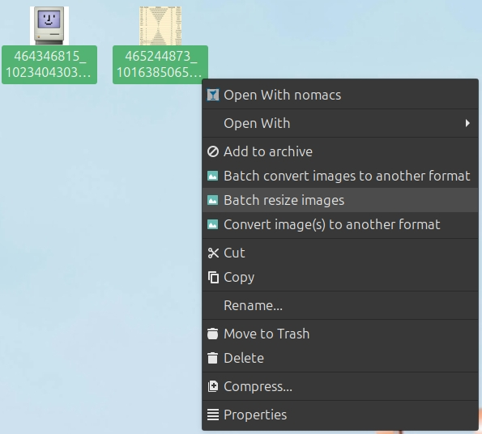
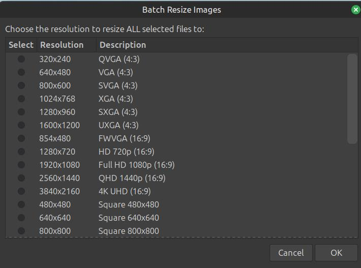

# Nemo Batch Resize Images

A Nemo file manager extension that provides batch image resizing functionality through a convenient right-click context menu.

## Description

This extension adds a "Batch resize images" option to the Nemo file manager context menu, allowing you to resize multiple images at once to common resolutions. The tool presents a user-friendly dialog with predefined resolution options and processes all selected images with a progress indicator.

## Features

- **Batch Processing**: Resize multiple images simultaneously
- **Common Resolutions**: Choose from 20+ predefined resolutions including:
  - Standard ratios (4:3): VGA, SVGA, XGA, SXGA, UXGA
  - Widescreen (16:9): HD 720p, Full HD 1080p, QHD 1440p, 4K UHD
  - Square formats: 480x480 to 2000x2000
  - Portrait orientations: 3:4 and 9:16 ratios
- **Smart Resizing**: Automatically maintains aspect ratio while resizing images to fit within specified dimensions
- **Progress Tracking**: Visual progress bar with file-by-file status
- **Internationalization**: Multi-language support (English, Spanish, French, Italian, and more)
- **File Validation**: Automatically skips non-image files with warnings

## Installation

1. Copy the entire `batch-resize-images` folder to your Nemo actions directory:
   ```bash
   cp -r batch-resize-images ~/.local/share/nemo/actions/
   ```

2. Copy the action definition file:
   ```bash
   cp batch-resize-images@badmotorfinger.nemo_action ~/.local/share/nemo/actions/
   ```

3. Restart Nemo or refresh the file manager to load the new action.

## Dependencies

This extension requires the following tools to be installed:

- `zenity` - For GUI dialogs
- `convert` (ImageMagick) - For image processing
- `file` - For MIME type detection
- `xargs` - For command processing
- `pdftoppm` - For PDF support

Install dependencies on Ubuntu/Debian:
```bash
sudo apt install zenity imagemagick file findutils poppler-utils
```

## Screenshots

### Context Menu


### Resolution Selection Dialog


## Usage

1. Select one or more image files in Nemo
2. Right-click and choose "Batch resize images"
3. Select your desired resolution from the dialog
4. Click OK to start the batch resize process
5. Resized images will be saved with the format: `originalname_resolution.extension`

**Note**: The resizing process automatically maintains the original aspect ratio of your images, ensuring they fit within the selected dimensions without distortion.

## Supported Formats

All image formats supported by ImageMagick, including:
- JPEG/JPG
- PNG
- GIF
- BMP
- TIFF
- WebP
- And many more

## Example

If you resize `photo.jpg` to `1920x1080`, the output will be `photo_1920x1080.jpg` in the same directory.

## Version

Current version: 1.0.0

## Author

badmotorfinger

## License

This project is provided as-is for use with the Nemo file manager.